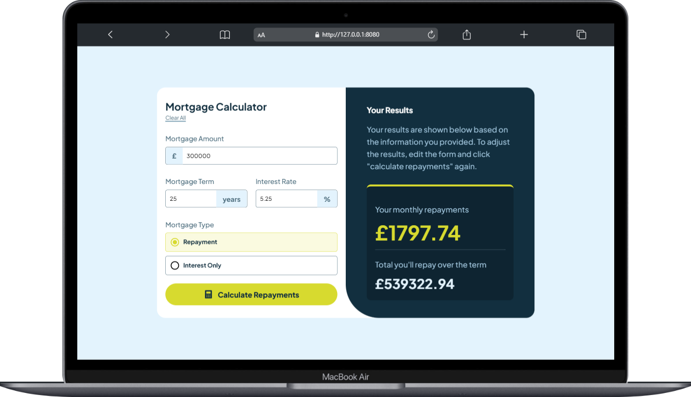
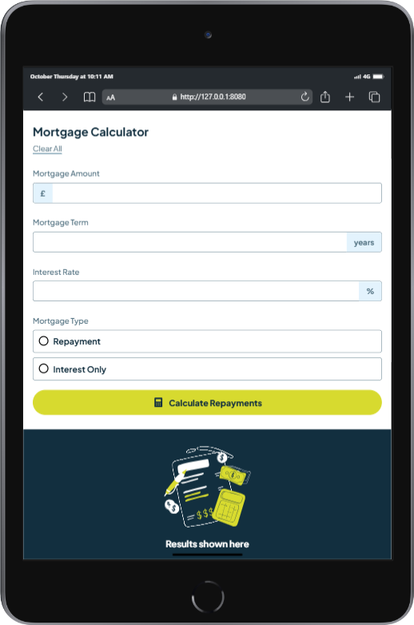

# Mortgage Calculator

A fully responsive mortgage calculator that allows users to input their mortgage amount, term, interest rate, and type to calculate their monthly repayments. This project is built using HTML, CSS, and JavaScript.

## Table of Contents

- [Features](#features)
- [Demo](#demo)
- [Technologies Used](#technologies-used)
- [Installation](#installation)
- [Usage](#usage)
- [Contributions](#contributing)
- [License](#license)
- [Acknowledgements](#acknowledgements)

## Features

- Responsive design for mobile and desktop devices.
- Clear and user-friendly interface.
- Input validation to ensure all required fields are filled.
- Calculates monthly repayments and total amount repayable over the term.

## Demo

### Screenshots

#### Website Preview on Laptop

Here are some previews of the website on a Laptop:


#### Website Preview on Tablet

Here are some previews of the website on a Tablet:



#### Website Preview on Phone

Here are some previews of the website on a phone:

<div style="display: flex; justify-content: center; flex-wrap: wrap;">
    
    
</div>

## Technologies Used

- `HTML5`
- `CSS3`
- `JavaScript`

## Installation

1. Clone the repository:
   ```bash
   git clone https://github.com/khalidrahmanhanify/mortgage-calculator.git
   ```
2. Navigate to the project directory:

   ```bash
   cd mortgage-calculator
   ```

3. Open `index.html` in your web browser to view the project.

## Usage

1. Enter the Mortgage Amount in pounds.

2. Specify the Mortgage Term in years.
3. Input the Interest Rate as a percentage.

4. Select the Mortgage Type (Repayment or Interest Only).
5. Click on Calculate Repayments to see the results.
6. Click on Clear All to reset the fields.

## Contributing

Contributions are welcome! If you have suggestions for improvements or want to add features, please follow these steps:

1. Fork the repository.
2. Create a new branch:
   ```bash
   git checkout -b feature/YourFeature
   ```
3. Commit your changes:
   ```bash
   git commit -m "Add some feature"
   ```
4. Push to the branch:
   ```bash
   git push origin feature/YourFeature
   ```
5. Open a pull request.

## License

This project is licensed under the MIT License - see the `LICENSE` file for details.

# Acknowledgements

- Inspiration from various online mortgage calculators.
- Thanks to the contributors who helped in the development of this project.
